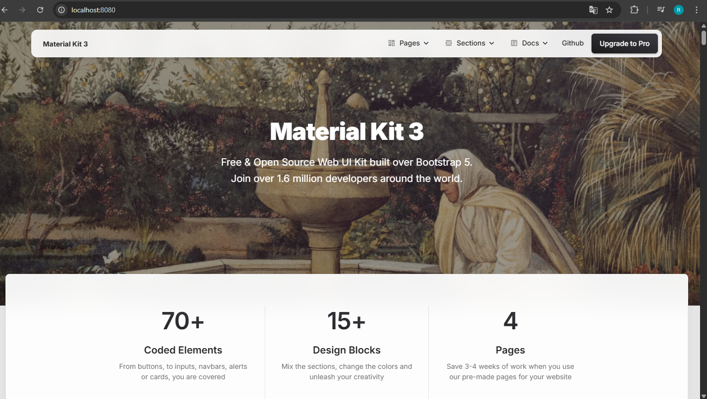

# Exercício 09 - Criando uma Imagem Personalizada com um Servidor Web e Arquivos Estáticos

Construa uma imagem baseada no Nginx ou Apache, adicionando um site HTML/CSS estático. Utilize a [landing page do Creative Tim](https://github.com/creativetimofficial/material-kit) para criar uma página moderna hospedada no container.

---

## Passos para Configuração

### 1. Clonar o Repositório do Material Kit
Primeiramente, clone o repositório que contém os arquivos do site estático:

```bash
git clone https://github.com/creativetimofficial/material-kit.git
cd material-kit
```

---

### 2. Criar o Dockerfile
No diretório `material-kit`, crie um arquivo chamado `Dockerfile` e adicione o seguinte conteúdo:

```dockerfile
FROM nginx:alpine
RUN rm -rf /usr/share/nginx/html/*
COPY . /usr/share/nginx/html/
EXPOSE 80
```

**Explicação do Dockerfile:**
- `FROM nginx:alpine`: Utiliza a imagem base do Nginx com Alpine Linux, que é leve e otimizada.
- `RUN rm -rf /usr/share/nginx/html/*`: Remove os arquivos padrão do Nginx.
- `COPY . /usr/share/nginx/html/`: Copia os arquivos do projeto para o diretório padrão do Nginx, onde os arquivos do site serão servidos.
- `EXPOSE 80`: Expõe a porta 80 para o tráfego HTTP.

---

### 3. Construir a Imagem Docker
Construa a imagem Docker utilizando o `Dockerfile` criado:

```bash
docker build -t material-kit-site .
```

**Explicação:**
- `-t material-kit-site`: Define o nome da imagem como `material-kit-site`.

---

### 4. Executar o Container
Execute o container com a imagem criada:

```bash
docker run -d -p 8080:80 --name material-kit-container material-kit-site
```

**Explicação:**
- `-d`: Executa o container em segundo plano (modo detached).
- `-p 8080:80`: Mapeia a porta 80 do container para a porta 8080 do host.
- `--name material-kit-container`: Define o nome do container como `material-kit-container`.

---

### 5. Testar no Navegador
Acesse o site no navegador utilizando o endereço:

```
http://localhost:8080
```

Se tudo estiver configurado corretamente, você verá o conteúdo do Material Kit sendo exibido.



---

## Gerenciamento do Container

### Parar o Container
Para parar o container em execução:

```bash
docker stop material-kit-container
```

### Reiniciar o Container
Para iniciar novamente o container que foi parado:

```bash
docker start material-kit-container
```

### Remover o Container
Para remover o container completamente:

```bash
docker rm material-kit-container
```

---

## Observações Finais
- Certifique-se de que a porta 8080 está livre no seu host antes de executar o container.
- Caso faça alterações nos arquivos do Material Kit, você precisará reconstruir a imagem para aplicar as mudanças:
  ```bash
  docker build -t material-kit-site .
  ```

Agora você tem um servidor web personalizado com uma página moderna, hospedado em um container Docker!
